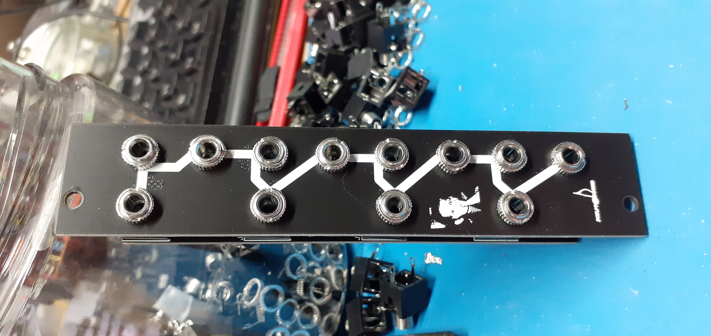
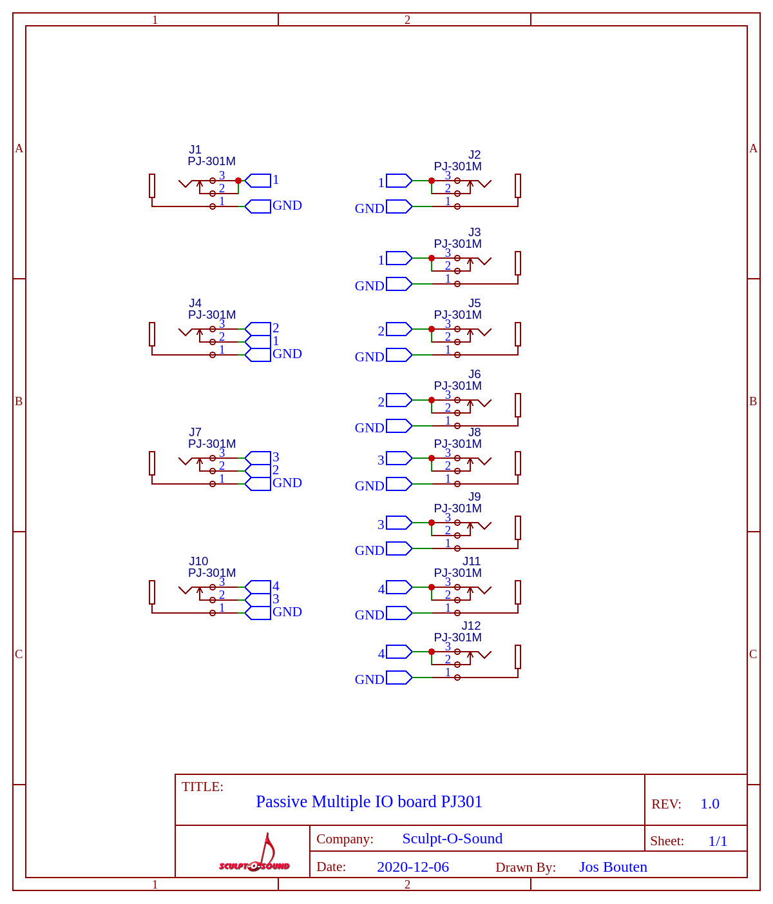
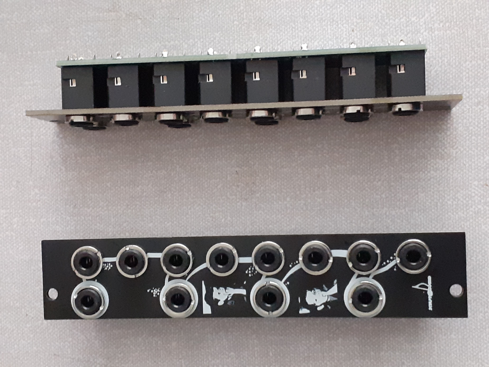
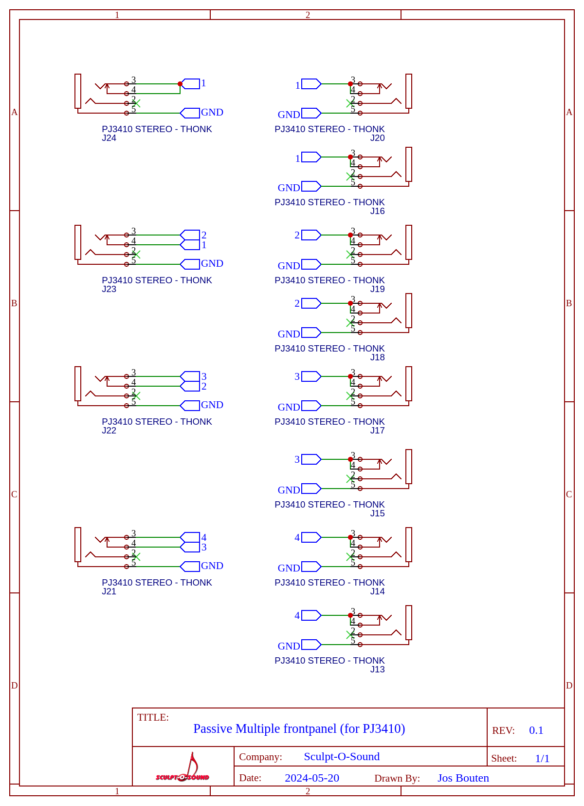

Passive-Mult-O-Matic

Passive-Mult-O-Matic is a passive multiple for eurorack based on a design by Kristian Blasol (of Modular in a Week fame). You will find 2 versions here. One which uses PJ301M jacks, the other PJ341 jacks.

This is the version using the cheap PJ301M jacks:

This is the version using the PJ341 jacks (a bit more expensive):
The advantage of this version is that you can not short the top of a jack plug to chassis (which is often connected to GND) when inserting it because the opening of the connector is made of plastic. This will often happen when using the PJ301 based version of the multiple.

As you can see in the schematics, if you put a signal in J1, you will find a copy of the signal on J2, J3, J5, J6, J8, J9, J11 and J12. If however you plug a patch cable into J4, J7 or J10, then their respective switching contacts will restrict the number of multiples of J1 but create multiples of themselves. In this way you can make a lot of multiples of one signal or small groups of multiples of several input signals.
